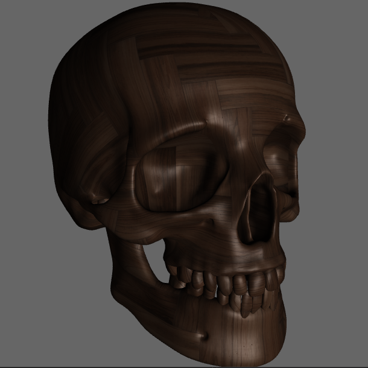
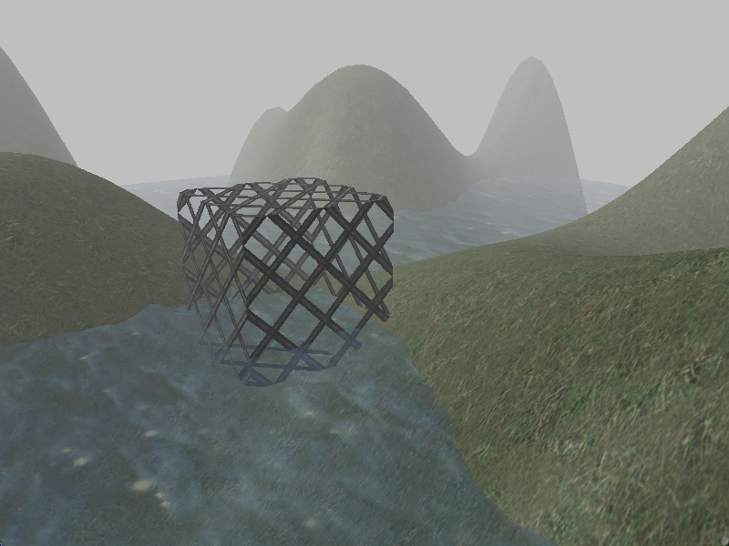
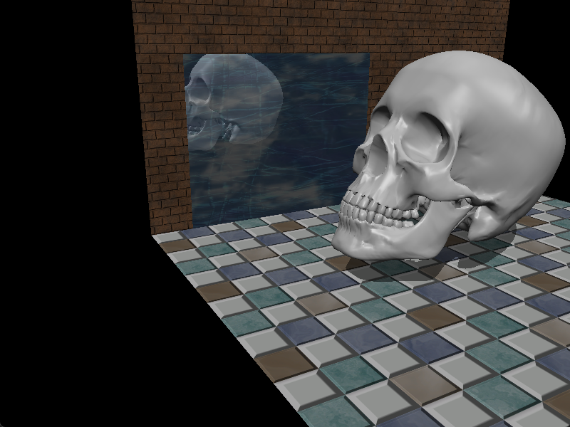
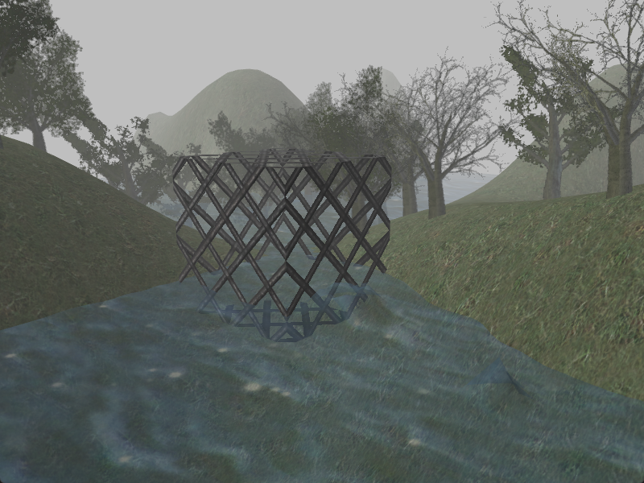
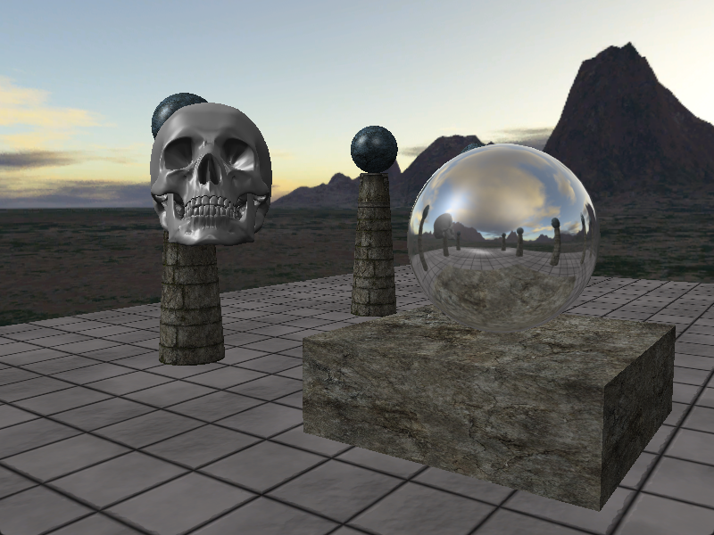

i have become a book nerd.

<!--more-->

so, some months ago i decided to properly learn 3D rendering and then make a 3D game. this will probably be a life long journey and i'm just getting started.

so, i started learning DirectX 11 with the help of a book called [Introduction to 3D Game Programming with DirectX 11 by Frank Luna](https://www.amazon.com/Introduction-3D-Game-Programming-DirectX/dp/1936420228).

i also bought 2 more books that i'll check out later:

[Real-Time Rendering, Fourth Edition](https://www.amazon.com/Real-Time-Rendering-Fourth-Tomas-Akenine-M%C3%B6ller/dp/1138627003)

[Game Engine Architecture, Third Edition](https://www.amazon.com/Engine-Architecture-Third-Jason-Gregory/dp/1138035459)

anyway, studying this has been hard at times, but also really exciting. you need to know lots of math to understand 3d rendering. that's been hard. fortunately at this age you have a lot of free resourses at your disposal on the internet for free, for math.

[here is my github repo](https://github.com/lucypero/lucybookexercises) for all the code samples of the book. I had to port all of them just to run them on a modern system, because this dx11 book uses old and deprecated libraries and the deprecated DX SDK. i also do most of the exercises at the end of each chapter, they are in the repo too.

so basically it's about first learning how to use the DX11 API and then learn about all the standard techniques to achieve certain visual effects for your game. here are some demonstrations:

Blinn–Phong lighting with color and specular textures
 

 

Blending Demo - transparency, alpha clipping, fog, water
 

 

Mirror Demo with Stenciling
 

 

Tree Billboards
 

 

Skybox and Dynamic Reflections with Cube Maps
 

 

very soon i will start setting up my first 3D game. i'll keep posting updates. exciting stuff.