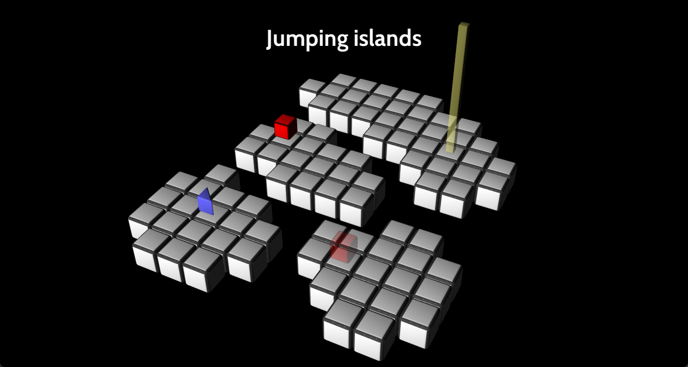

I embarked on the journey of creating a 3D game from scratch in June '23 to put all my 3D rendering knowledge to practical use. My aim was not only to apply what I've learned about 3D rendering but also to gain insights into the entire process of game development.

This game is written in C++20, utilizing Direct3D 11 for GPU communication, and it's being developed for Windows.

The primary objectives of this project are technical in nature. I'm focusing on implementing game systems such as animations, timers, and rendering from a low-level perspective. The actual design of the game takes a backseat in this endeavor. If my main goal were to create a polished game, I'd opt for a game engine like Godot.

I'll be sharing my journey through blog posts as I progress, documenting the challenges I encounter and discussing what I'm learning along the way.

Fast forward to October, and it's been four months since I embarked on this adventure. The first lesson I've learned is that building something from scratch takes a considerable amount of time. This realization has underscored the importance of reusing existing components to expedite progress.

Let's delve into some of the key topics I'd like to cover:

## What Type of Game Am I Creating?

The game I'm working on is reminiscent of the classic [Sokoban](https://en.wikipedia.org/wiki/Sokoban) genre, which is essentially a grid-based puzzle game where you push objects to solve puzzles. I chose this genre primarily for its seemingly manageable complexity in terms of implementation.

Initially, I attempted to create an entirely original game, but that proved to be a challenging endeavor. Trying to build both an engine from scratch and create an original game simultaneously was overwhelming. Consequently, I've decided to emulate existing Sokoban games for now. Once the engine matures, I can inject more originality into the game.

All the levels and mechanics in my game, as of now, are borrowed from a game called [Mirror Isles](https://alan.draknek.org/games/puzzlescript/mirrors.php). Credit for the gameplay and level design goes to that game.

I've also come to realize that game design, including crafting levels and mechanics, is a skill that eludes me at this point. However, I believe it's attainable with more practice and dedication.

## Appreciating the Value of Time

Working on this project has deepened my appreciation for the convenience of public game engines. Creating everything from scratch in C++ is a time-consuming endeavor, especially when you have to build all the systems and tools from the ground up. Watching people [create playable games in Godot in 44 hours](https://www.youtube.com/watch?v=8bhNXunrEaU) made me reflect on the time investment required. However, it's essential to remember that my primary goal isn't speed; it's about the learning experience.

Time is our most precious resource. When faced with a task, I now make a concerted effort to estimate the time required for each approach and prioritize the one that minimizes time expenditure.

## Building Releases in "Sprints"

One effective strategy I've implemented is releasing a new build every two weeks to testers. This approach has been a significant motivator for me. It allows people to see the progress and new features, and receiving feedback from testers is incredibly motivating.

Additionally, I've set a release date for version 1.0 of the game, scheduled for November 12th, 2023. This fixed date serves as a strong motivation to prioritize essential tasks and avoid getting caught up in non-essential aspects that could delay the release of a playable game.

# The Technical Aspects

## Some things I implemented for the game

In terms of rendering, my progress has been modest. So far, I've accomplished the following:

- Text rendering: I use `freetype` to render glyphs from a ttf font into one atlas texture.
- 3D rendering: I import GLTF models using `assimp`. It has basic Blinn-Phong lighting, with Color and Specular textures. I do instanced rendering with support for transparency.

However, the bulk of my time has been devoted to other systems, such as hierarchical transforms, gameplay mechanics, and the animation system.

I've developed a basic implementation of [Generational Indices](https://lucassardois.medium.com/generational-indices-guide-8e3c5f7fd594), which has proven invaluable for various tasks.

# FAQ

## What's Next?

I plan to dive into various technical aspects crucial for this project, including:

- **Indirect Drawing**: This optimization streamlines CPU code and reduces draw calls. Currently, I'm sorting all instances by the 3D model they represent, resulting in one draw call per model. Implementing this GPU feature could consolidate multiple instances into a single draw call.

- **Shadows**: These are essential for enhancing depth perception.

- **Shaders**: Shaders are a skill I'm actively working on. Mastery of shaders is crucial for game development, especially for post-processing effects and other visual enhancements. I might use [The Book of Shaders](https://thebookofshaders.com/) as my primary resource.

As for specific goals for the 1.0 release of the game, it must be presentable. This entails a decent user interface, sound effects, music, polished graphics, and at least one unique gameplay mechanic. I'll continue posting updates to document my progress.

## Source Code?

I intend to release the source code, likely around the time of the 1.0 release.

## Can I Play the Game?

Currently, I release builds to friends and acquaintances on Discord. Version 1.0 will be publicly released for free.

## A Screenshot (Work in Progress)

This screenshot is from Build 2, released on 01-09-23:

