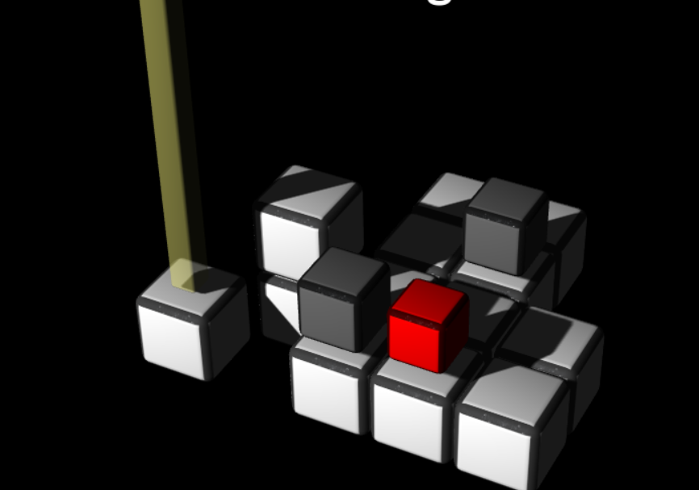
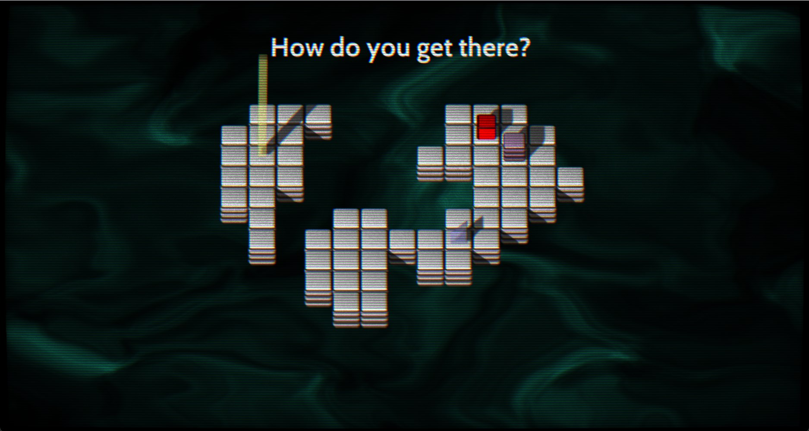
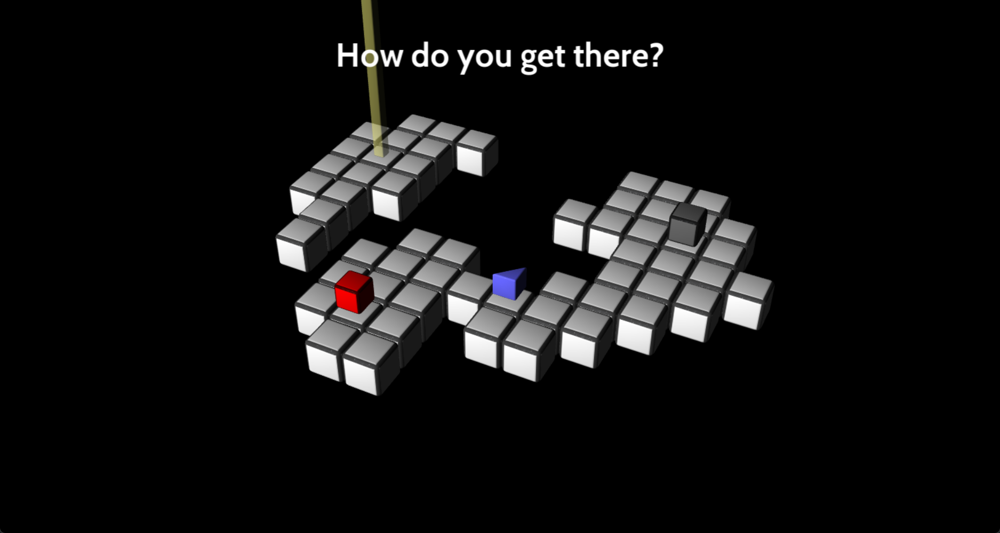

This is a follow-up to [game update 1](./3d-game-update-1.html)

The last time I wrote a progress update was right after I released Build 2. Now, we are at Build 4 and 2 weeks away from releasing the final build: The `1.0` release.

All the technical aspects are finished. I'm going to focus on adding levels and mechanics from now on. I'll now talk about the main things that were added to the game, and also changes.

## Shadow mapping

This was a big one, as I haven't implemented shadows before. I read the Shadow mapping chapter on my trusty [DX11 book](https://www.amazon.com/Introduction-3D-Game-Programming-DirectX/dp/1936420228), and I got to work. It took me longer than I thought, but I got lucky because this game has small requirements on shadow technology. Just one simple shadow map is more than enough.

It's a 2K shadowmap with PCF filtering and slope-scaled bias. The last one is a Direct3D feature. Doing just those 2 things renders perfect and beautiful shadows for this project. The only shame is that they are not very visible after I did the next thing...

## Post processing

I set up a post processing pipeline on my engine so I could apply trippy effects like the one in the picture. My idea for the game is to have a very trippy, surreal feel because I very often like that in games. Hotline Miami and Super Hexagon come to mind. I find presentation to be extremely important in a game and the kind of feel, vibe, and mental state that this kind of effects put me in is something that I find very pleasing for some reason. One recent example of this is [Balatro](https://store.steampowered.com/app/2379780/Balatro/). The effects are implemented really well in that game. They elevate the experience in a way that shouldn't be dismissed.

All the post-fx shaders were modified copies of free shader code I found online. Coding shader effects is a whole other realm for me. I'm just getting started learning all that, so I had to copy code for now, haha.

## Camera/Visibility changes

I made changes for visibility reasons. Players were having trouble visualizing the level, so I made that a priority. First, I changed the camera mode to orthographic. That means there is no perspective distortion anymore. This makes the game look like it's 2D. At first I thought it hampered the visuals of the game, but it grew on me.

Another change was to change the texture of the floor cubes. They now have their sides textured so it is impossible to misread them if you are new player.

I also added camera sway, or a "drunk camera" effect to add to the trippy feel of the game. I really like it, personally.

## Music and sound effects

My boyfriend was kind enough to work on the music and sound for this game. The results were amazing. I think people will really like it. I won't post the music here; you'll have to wait for the game for that.

I took an interest in sound and music in games since this experience. They are so, so important for a game, so I have to know the basics, at the very least.

## Conclusion

Here's a comparison shot:

Build 2:

Build 4, after all the improvements, changes, and additions:

Well, that's it! See you in 2 weeks when I release `1.0`! I will release it publicly to everyone on itch.io for free.