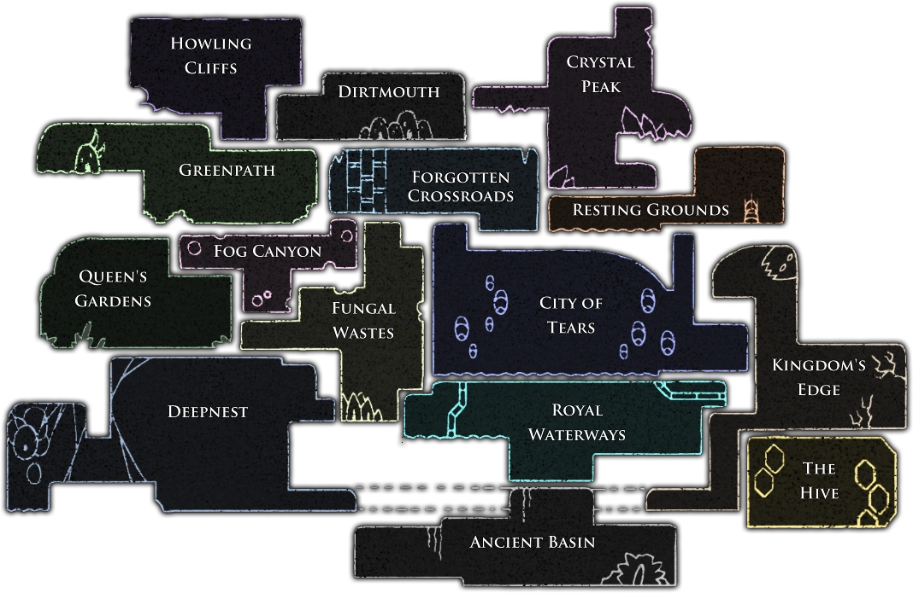
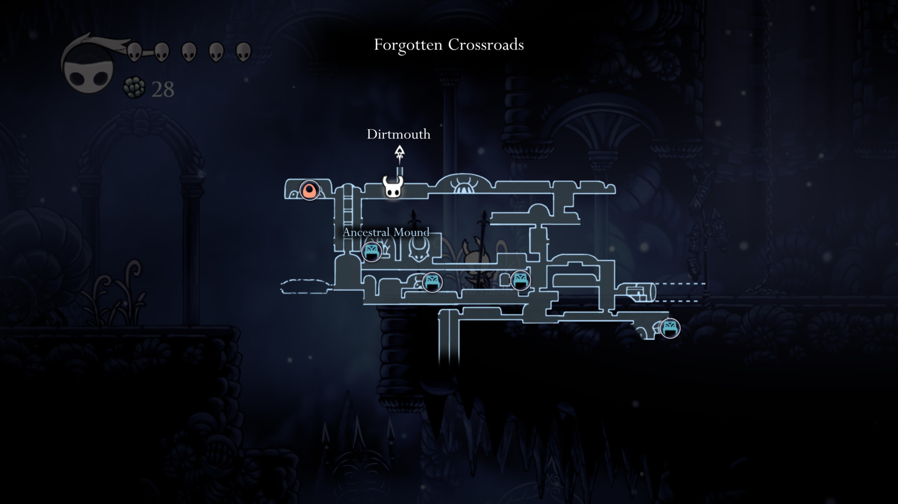
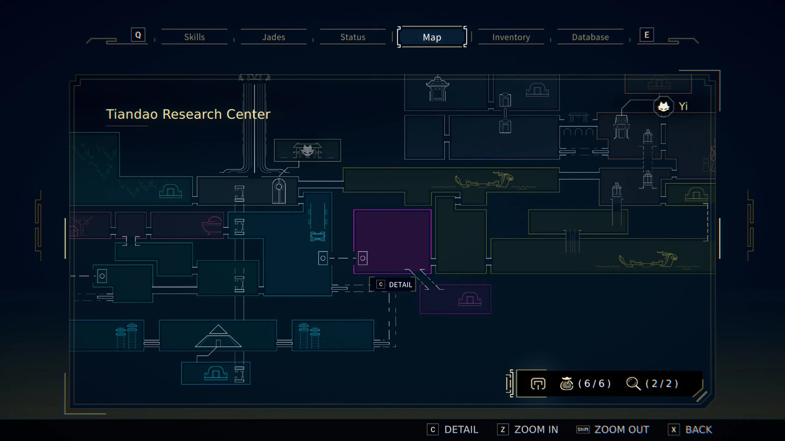

*Cute little guy*

I've been playing [*Nine Sols*](https://store.steampowered.com/app/1809540/Nine_Sols/) for about 13 hours and I think I won't go back to it now.

For an overview of the game: It's a decent metroidvania game with great hand-drawn visuals and a unique setting. They call it "Taopunk", it's quite interesting and original.

Apart from the visuals and setting, the game doesn't stray too far from other games in this "metroidvania mixed with dark souls" genre. It's serviceable. It plays it extremely safe. One of the main aspects of the combat is the *parry* mechanic. It's a very overused mechanic recently in games, and from someone who has played *Sekiro* and loves it to death, and just beat *Lies of P*, the parry in this game is quite underwhelming. It just doesn't feel very satisfying. Everything you do in combat doesn't have a lot of *impact*, in fact.

But it's fine! It's a perfectly serviceable combat system. I'm not writing this article because of these things. We're gonna talk about why I dropped the game; and what has frustrated me so much time and time again while trying to make progress in this damn game.

# Hostile navigation

What ruined my experience playing *Nine Sols* is that the game tries its best to get you lost. This has been the hardest game to navigate that I have played in recent memory. I ran around in circles for hours. It's infuriating. The game doesn't even give you a hint about where to go next. The map viewer isn't very helpful. Most areas are indistinguishable from each other. The map is very open with little sense of structured progression, so whenever you complete an area, chances are you'll be back to square one and have absolutely no idea where to go next.

I'll try to be as precise as I can explaining the problem: Progression *within* levels is good. The problem is when you finish a story beat and you're done with your current area. Figuring out where you need to go next might take hours. What also happened in my playthrough is that sometimes when I seemed to have found the way, I explore, then after a while I realize that it's an optional area and that I haven't done any real progress, and I'm back at square one.

I've been having these thoughts about the game's navigation for a while. I talked about it with other people and most seemed to agree in some way. Then I looked online and I saw a lot of people begging for help on various forums. This is a real problem in the game. But what really prompted me to actually write about this and start my vendetta against this game is the thought that... *they did this on purpose*.

# No, of course they didn't do it *on purpose*. Did they, though?

Yes, the problem is so bad that you can't help but wonder. It gives me the slight impression that they intentionally want the player to get lost constantly, to pad out the game's runtime.

Of course, I have no evidence to back up this theory, and I'm not sure if I actually believe it; but it doesn't really matter. Either the game is intentionally obtuse about you finding your way to make the game longer without having to produce more content, or they think there's nothing wrong with the navigational design in the game. Both options are equally bad.

Whether intentional or not, the game's exploration design leads to a frustrating experience where the player feels deliberately starved of much needed information.

# Failing where Hollow Knight succeeded

For contrast, let's talk about all the tools and information Hollow Knight gives you to navigate its giant open-ended world. It's a very apt comparison as these games share the same "metroidvania/Dark Souls" genre.

- Each biome is quite distinct in style and in enemy variety.
- The way you acquire more maps and information within those maps has a clear progression, resulting in a clear understanding of what you already explored versus uncharted territory
- Gamified navigational tools, like you can buy pins that automatically mark different things on the map. You can also buy custom pins that you can place wherever you want. This lets you keep a personalized record of your travels and what you've obsersed and haven't observed.
- It is very clear when you can't proceed because you lack a certain ability. This could be a transition between biomes (easy to remember), or something very memorable and distinct, like a black flowing barrier.
- The map view is much easier to understand.

*Well defined areas with their unique shapes and landmarks*

*Pre-placed markers and custom markers for the player help a lot*

The game has many more tools to orient the player that are more suble than this, but this is just what came to mind. Nine Sols lacks all of this.

# What else could they have done?

I think I covered enough ideas in the Hollow Knight section, but here's a couple more:

- NPC's informing you of your current quest, and talking to you about locations. Anything that could give you a clue about where you are and where you're going. Maybe new NPC's could call you with clues, or taunting you towards the next area.
- Some kind of progression log. This could be not subtle at all, like a literal Quest Status section on the menu; or *something* in the Hub that informs you of your current progress, like maybe a canvas on a wall that is progressively filled.
- A *better* map view. Differentiate explored areas with unexplored areas. Tempt me with a blacked out area in the map that I haven't gone to yet. Something. Just do *something* to help.

# Rebutting some counter points

### "The AI guy tells you where to go"

There's a robot/AI furry person/thing inside your hub. Sometimes (very rarely), it will tell you something that could be considered "useful". But:

- The AI guy will very rarely tell you where to go.
- If it does tell you, it won't be very specific.
- **If it does tell you, it will never tell you again**. It will only tell you *once*. Subsequent dialogue prompts will be about something useless. That means that if you accidentally skipped that line, or you forgot what it said, there is *no way* to get that information inside of the game.
- Why would they make important information like that so easily missable?

### "Sometimes, the game marks the map for where to go next"

- Yes, but it does this so, so, *so* rarely.
- **Sometimes, the game will point towards a dead end**. This has actually happened to me. It pointed me somewhere, but at the end of that area, I needed a key to proceed. Where do you get the key? Good luck with that!
- Just like the previous point, **they only mark it on the map once**. After you saw it for the first time, the marker disappears forever.
- Why? Why would they do this?

*The overview map isn't very useful... It's pretty, though!*

### "It's about exploring past areas until you find the next thing! You have to take it slow!"

This isn't good enough for me anymore. I have much less tolerance for a game wasting my time than when I was younger. This just doesn't cut it anymore. If you want the game to be about paying attention in the environment and exploring and being curious, that's perfectly fine! And I might even enjoy it a lot, like I have for many games. But it fails at this. There are many games that do this so much better. You can make it fun. You can make it so exploration and trying to find the next thing is actually enjoyable and worthwhile. Nine Sols doesn't even attempt this.

# It's not me.

I'm very comfortable admitting that I'm not the best at navigation. Neither in games nor in real life. I get lost very easily. Still, this game is just so awful in this regard as I just explained, and considering what I've heard from other people getting lost, I *know* that the problem I have with this game isn't just about me not being good at navigation.

I have played many metroidvanias, and recently I've played a few games where exploration is their *main* thing, and I still loved the experience. There's a chapter in [*Signalis*](https://store.steampowered.com/app/1262350/SIGNALIS/) where you *don't even have a map!*, and its level design intentionally tries to disorient you. And I still loved it! Right now I'm playing [Tunic](https://store.steampowered.com/app/553420/TUNIC/), which is mainly about *the joy of discovery*. Maps are rare and you have to pay attention to decipher all the cryptic information given to you to be able to navigate its open ended map and make progress. And the game is absolutely beautiful in all aspects. I am loving every second of it.

I'm just trying to make the point that Nine Sols's problem isn't that it has exploration in it and I'm not into it. Nine Sols's problem is that it does this very poorly, to the point of being **hostile**.

My time is better spent on games that actually try to not waste my time.
