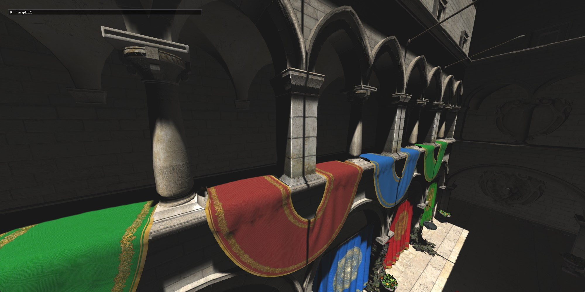
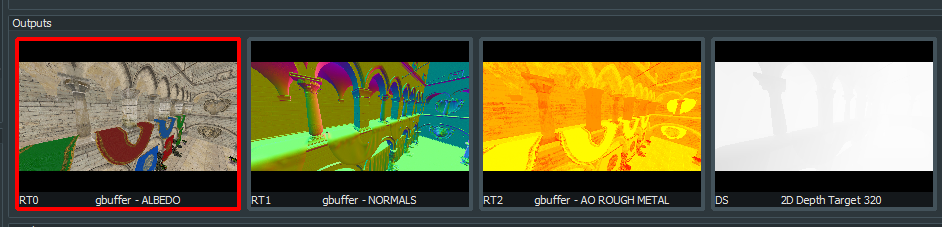
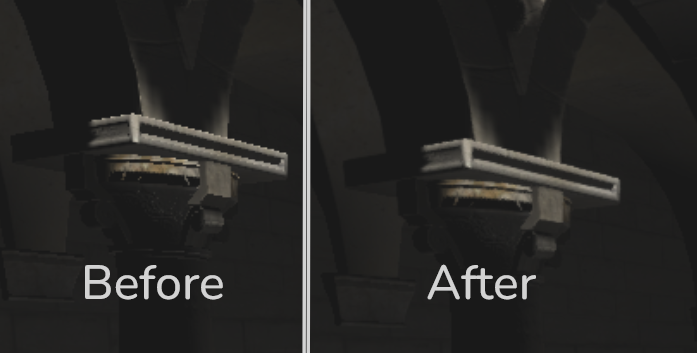

I've been working on Direct3D 12 for over half a year and I thought it was about time to write about what I've learned. Here's some cool stuff I've learned in the process. But before that, an overview:

[Link to the project's source](https://github.com/lucypero/lucydx12)

# What is this project about?

It just started as me trying to learn Direct3D 12 (DX12 for short). The goal is not defined well yet. For now, I'm just doing stuff I find interesting in the 3D rendering realm, and things that seem to be essential for a 3D renderer and/or game engine. Also, I'll do stuff that results in pretty frames, of course.

In the future, This project might turn into a real product, like a 3D renderer or game engine that would actually be useful for some end. But for now, it's just me learning stuff and having fun.

## How did I learn all this?

In short: Google, Gemini, and smart and kind people answering my questions in Discord. Plus, a little bit from books. I link to articles further into this article.

- (book) [Real Time Rendering](https://www.amazon.com/dp/1138627003?lv=shuf&channelId=500&plpRedirect=mhFallback) for rendering techniques.
- (book) [Game Engine Architecture](https://www.amazon.com/Engine-Architecture-Third-Jason-Gregory/dp/1138035459?crid=1HY8KOV9OQAH9&dib=eyJ2IjoiMSJ9.C1WfWFj2hVuDjMPJ_9fwoxoDnnoxssV1RZ-lt_weN3iLqetMclO1bkfgZFN39WJu8eyDtal5IDYZ4HeqfvXZcyhim-8KjmQcOxJdnJgT2buaO0qkYv0aiJ2l-gEugiYPv6Hvbwpgamo7w4S5B8af3gOoPlhSHOuTQNciwts-AhQyw6K5oyYHZZcyXGGb_qSPbZtTn9T8Hu--BxbvcgSdu7BJy39LqoqiNorTziF-d8w.ydDsxjq6lffURL1kYEuCCqtwRLrGnLTWJPcBwIQeN0E&dib_tag=se&keywords=Game+Engine+Architecture&qid=1783271361&s=books&sprefix=%2Cstripbooks%2C242&sr=1-2) for multithreading theory.

# Tools used

- [Odin](https://odin-lang.org/): The greatest programming language.
- [Zed](https://zed.dev/): It's currently my favorite code editor. It's awesome.
- [The RAD Debugger](https://github.com/EpicGames/raddebugger): The greatest debugger ever made. It's still in alpha so there are some bugs, but still it's an absolute joy to use.
- [RenderDoc](https://renderdoc.org/): Essential for debugging the GPU. I love it. Recently I even set up shader debugging. I can debug shader code as if it's CPU code, which is really cool.
- [Spall](https://github.com/colrdavidson/spall-web): I don't use this anymore as I found it limiting; and development has ceased. In the future, I'll try another profiler, like Tracy.
- Git + [Sublime Merge](https://www.sublimemerge.com/): As I've said before, Sublime Merge is the best way to interact with Git, and everyone should use it. I've used it for many years, and I forced all the artists at work to use it. And they're happy for it.
- And of course, I have to use Windows for DX12. But that's OK, as all the best software runs on it (and _only_ on it in some instances like RAD), and it's still the [best OS for software development](https://lucypero.com/blog/windows-development.html).

# Learning DX12 itself, and coding the project

Coming from DX11, DX12 is big. You have to manually do some things that I took for granted. A lot of it is boring so I won't write much about it. The great thing is: DX12 itself has changed a lot over the years. It is now over 10 years old. It improved a lot over the years, and it got simpler in many ways. A lot of this is thanks to how much the hardware has changed, as well. [Sebastian Aaltonen](https://www.sebastianaaltonen.com/blog/no-graphics-api) talks about this.

What's great is that right now, you don't have to do many things that you had to do before in older versions of DX12, and in older graphics API's like DX11 and OpenGL.

- One big thing is the whole concept of "bindless": If your hardware supports this, you no longer have to "bind" specific resources on your Root signature when executing a PSO (Pipeline State Object). This means that you can have one single and very simple Root Signature for all your PSO's, and access every resource you need from your shader by indexing directly from your Resource Heap. So now, all you need to sample a texture in a shader now is to create the texture resource and SRV, pass the index of the texture to the shader in any way you want (I pass indexes mostly through one big CBV), and that's it. No more rigid binding of resources that resist refactors. This keeps both CPU and GPU code lean and fast.

I notice as I'm writing this that this is extremely technical and thus very hard to explain. I'll link this [article](https://rtarun9.github.io/blogs/bindless_rendering/) that talks about bindless rendering better than I can.

- You can go even further with this concept and do away with Input Layouts all together, but I haven't done that (yet). That goes too far for me just yet. Also there's some possible bad performance implications, as this [article](https://www.yosoygames.com.ar/wp/2018/03/vertex-formats-part-2-fetch-vs-pull/) explains.

As I've been writing this renderer, I took some time doing reformatting. Turns out, dealing with DX12 isn't so bad when you understand it well enough, and have the right structs and helper structs. `texture_create` is doing a [looot of things in my code](https://github.com/lucypero/lucydx12/blob/main/src/dx_helpers.odin#L494). Tying together the texture's resource with its views is essential, as seen in my `Texture` struct.

```odin
// indexes are -1 if the view was not created
Texture :: struct {
	buffer: ^dx.IResource,
	format: dxgi.FORMAT,
	srv_index: int,
	dsv_index: int,
	rtv_index: int,
	uav_index: int,
	width: int,
	height: int,
}
```

I learned pretty early that it's good to create one "Uber heap" per each heap type in DX12 and just put every descriptor in one of those as you create them - see `uber_heap_create` [here](https://github.com/lucypero/lucydx12/blob/main/src/dx_helpers.odin#L38C1-L38C17)

One other thing of note is how I'm handling PSO's (Pipeline State Objects). I just have one `pso_create` that defines _everything_ about a [PSO](https://github.com/lucypero/lucydx12/blob/main/src/dx_helpers.odin#L229). The render proc that I pass as a proc pointer then gets called automatically every frame. The renderer renders all PSO's in an array, in order, automatically:

Here, I'm using Odin's [enumerated arrays](https://odin-lang.org/docs/overview/#enumerated-array).

```odin
/// This gets stored in a huge Context struct that holds everything
psos: [PSOName]PSO,
```

```odin
// All our PSO's
// The ORDER of these items matter a lot. it's the order in which the PSO's are rendered.
PSOName :: enum {
	Shadowmap,
	GBuffer_Pass,
	Lighting_Pass,
	Gizmos,
	PostProcess
}
```

```odin
// in the render loop..
for pso in ct.psos {
	pso.render_proc(pso)
}
```

# Deferred rendering

The renderer uses a standard deferred rendering setup: I first do a geometry pass that renders to 3 Buffers: Albedo, Normal, and AO+Roughness. Then, a lighting pass reads from these buffers to produce a frame. The pipeline keeps going after that, but that's the deferred part.



# Worker thread for asset loading

Turns out the GPU has a whole separate pipeline just for copying data from CPU to GPU memory. So I set that up, mostly in [here](https://github.com/lucypero/lucydx12/blob/main/src/dx_upload.odin). I have a worker thread that waits for scenes to be in a "to load" state, and starts loading the assets from disk to GPU memory. The threading code is probably very bad and there's probably some race conditions in there. I used atomics to synchronize things. I learned a lot about multithreading while doing this. It's still all very bad but it seems to work. You can now switch between scenes without any stutters, as assets get loaded to the GPU in the background without interrupting rendering.

This video shows a scene transition, as the camera is moving. No stutters. Butter-smooth gameplay.

<video controls>
  <source src="../assets/lucydx12/lucydx12_1ydJcmnS2Q.mp4" type="video/mp4">
</video>

# Anti Aliasing without MSAA

I'm not doing multiple samples per pixel because I'm on a deferred rendering setup. Therefore, Anti-Aliasing becomes tricky. For now, I set up a compute pass at the end of the pipeline, right before drawing the dear-imgui interface. And in there, I do [FXAA](https://developer.download.nvidia.com/assets/gamedev/files/sdk/11/FXAA_WhitePaper.pdf). The results are OK.



There was a hiccup while integrating FXAA. I was passing it the wrong UV coordinates. Instead of passing the center of the pixels, I was passing the corner. This resulted in a blurry image, with no evidence of edge detection.

Here's the right way to pass UV's to FXAA, in a compute shader:

```c
float2 inverse_screen_size = float2(1 / float(width), 1 / float(height));
// adding offset to land on the center of the pixel
float2 pixel_pos = (float2(dispatchThreadID.xy) + 0.5f) * inverse_screen_size;

// later...

FxaaFloat4 fxaa_out = FxaaPixelShader(
	pixel_pos, // pos

// ...
);

```

A lot more could be done in regards to AA. It's a big field in computer graphics. I will probably experiment with more techniques in the future.

# Shadow maps

I've implemented basic shadowmapping with PCF filtering. Not much to say here. I did the bare minimum. The shadowmap projection view's parameters are manually picked by me until the frame looked good. Much more work is needed here.

<video controls>
  <source src="../assets/lucydx12/lucydx12_4ECcmMXWgj.mp4" type="video/mp4">
</video>

# Using Odin's Runtime Type Information (RTTI) for shader code

I've used Odin's [RTTI](https://pkg.odin-lang.org/core/reflect/) to automate some things related to shaders. Odin packs information about your structs and other things in the executable, which let you automate some things very easily:

## Input Layouts

```odin
ct.psos[.Shadowmap] = pso_create("src/shaders/shadowmap.hlsl", PSOParameters {
	vertex_input = VertexData, // Passing a struct as the vertex input
	blend_state = .Off,
	enable_depth = true,
	depth_write = true,
	rtv_count = 0,
}, render_proc = pso_shadowmap_render, pso_name = "Shadowmap pso")
```

in `pso_create`, I simply pass a struct name, and the code dynamically generates the Input Layout for the PSO out of a struct definition. Defining Input Layouts and keeping them in sync with your structs was one of the most annoying parts of a graphics API, and now it's abstracted away. So, this struct:

```odin
VertexData :: struct {
	pos: v3 `POSITION`,
	normal: v3 `NORMAL`,
	tangent: v4 `TANGENT`,
	uv: v2 `TEXCOORD`,
	uv_2: v2 `TEXCOORD_SECOND_UV`,
}
```

... gets auto-converted into this:

```odin
{
  INPUT_ELEMENT_DESC{SemanticName = "POSITION", SemanticIndex = 0, Format = "R32G32B32_FLOAT", InputSlot = 0, AlignedByteOffset = 4294967295, InputSlotClass = "PER_VERTEX_DATA", InstanceDataStepRate = 0}
  INPUT_ELEMENT_DESC{SemanticName = "NORMAL", SemanticIndex = 0, Format = "R32G32B32_FLOAT", InputSlot = 0, AlignedByteOffset = 4294967295, InputSlotClass = "PER_VERTEX_DATA", InstanceDataStepRate = 0}
  INPUT_ELEMENT_DESC{SemanticName = "TANGENT", SemanticIndex = 0, Format = "R32G32B32A32_FLOAT", InputSlot = 0, AlignedByteOffset = 4294967295, InputSlotClass = "PER_VERTEX_DATA", InstanceDataStepRate = 0}
  INPUT_ELEMENT_DESC{SemanticName = "TEXCOORD", SemanticIndex = 0, Format = "R32G32_FLOAT", InputSlot = 0, AlignedByteOffset = 4294967295, InputSlotClass = "PER_VERTEX_DATA", InstanceDataStepRate = 0}
  INPUT_ELEMENT_DESC{SemanticName = "TEXCOORD_SECOND_UV", SemanticIndex = 0, Format = "R32G32_FLOAT", InputSlot = 0, AlignedByteOffset = 4294967295, InputSlotClass = "PER_VERTEX_DATA", InstanceDataStepRate = 0}
}
```

... Which is passed to DX12 in a call to `CreateGraphicsPipelineState()`.

## Generating HLSL structs out of Odin structs

In a similar way, I use RTTI to generate structs on the HLSL side. Example:

```odin

// This is a list of normal Odin structs.

@(rodata)
TYPES_FOR_HLSL := [?]typeid{GeneralConstants, DrawConstants, LightType, Light, TextureUV, Material}

// For example, Light:

Light :: struct #align (16) {
	type: LightType,
	position: v3,

	radius: f32,
	direction: v3,

	intensity: f32,
	color: v3,
}

// and then we generate like this...

// ...

for type in TYPES_FOR_HLSL {
	fmt.sbprintfln(&sb, "\n%v", convert_struct_odin_to_hlsl(type, context.temp_allocator))
}

```

The output for `Light` in HLSL becomes:

```c
struct Light {
	LightType type;
	float3 position;
	float radius;
	float3 direction;
	float intensity;
	float3 color;
};
```

The best thing about generating this code is that it only took me a few hours to learn and set up.

# GLTF processing

I get all asset data from a `.gltf` file. One interesting thing I did was a texture cache. GLTF doesn't store textures in a GPU optimized format, so what I did is this: when the code reaches the point where it's time to load a texture from the GLTF file, it consults a file cache to see if I already converted the texture. If I didn't, it generates the texture right there, with mipmapping. It does take a while to generate the textures. I use `texconv.exe` for this.

# Other stuff:

- [dear-imgui](https://github.com/ocornut/imgui) integration: I love this library! Using it, coupled with Odin's RTTI, I can tweak whatever I want in the program visually so, so quickly.
  - Used [Odin Imgui](https://gitlab.com/L-4/odin-imgui) for dear-imgui bindings for Odin.

# What to work on next

This renderer is only getting started. It still doesn't even have a proper lighting model. Lots of work is still to be done. And I'm still not sure what to make of this project. But as long as I'm learning cool things and I have fun, I will continue. I hope you got something out of this article.
