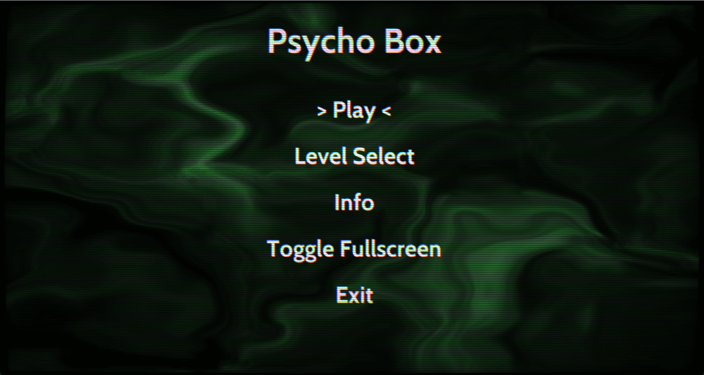
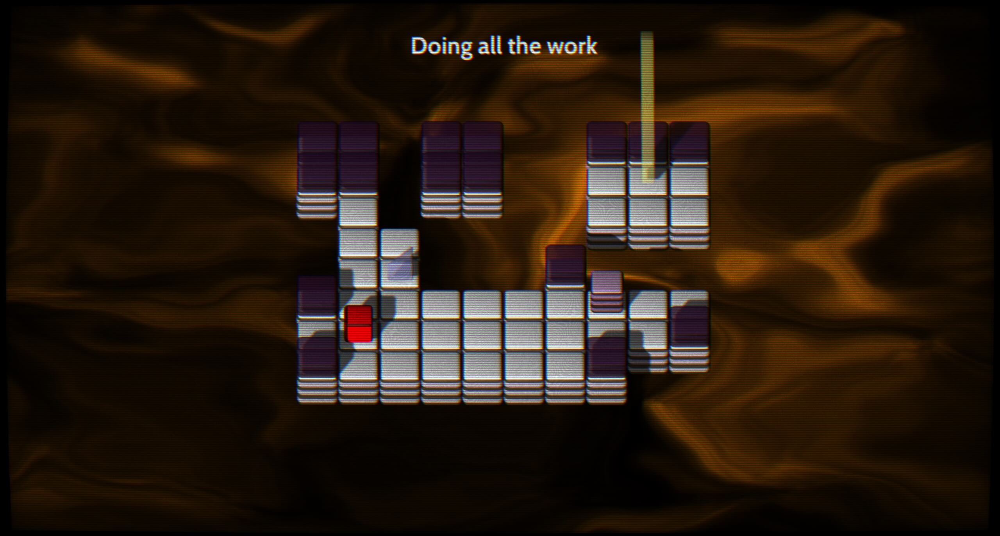
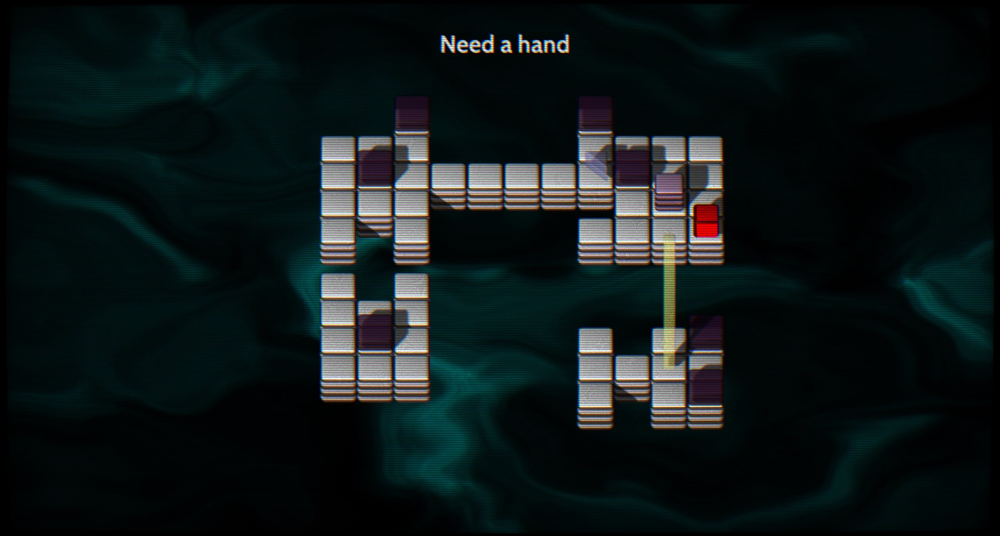
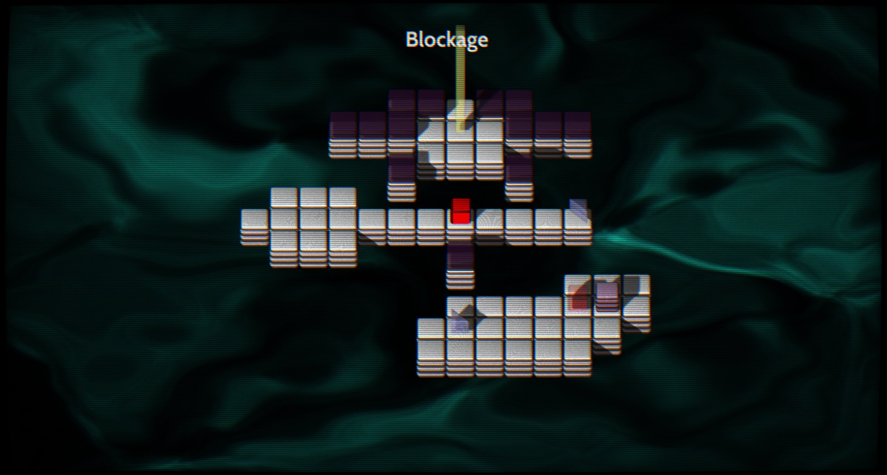

Psycho Box is out on itch.io!

<iframe frameborder="0" src="https://itch.io/embed/2366585?dark=true" width="552" height="167"><a href="https://lucypero.itch.io/psycho-box">Psycho Box by Lucy</a></iframe>

Psycho Box is a project that started as a self learning exercise. I wanted to know how to make a whole game from scratch. I did use some libraries that took care of some things for me, like audio, and model importing. I wanted to focus mainly on 3D rendering, and how to implement it in an actual game. 

When all the technical features were implemented, my attention started to shift to game design, and the pragmatism that is required to release a finished game. I had to learn how to design levels; and deliver a fun, challenging, and novel experience to players.

It was a wonderful adventure and I learned a lot.

## What's the game about?

Psycho Box is a [sokoban](https://en.wikipedia.org/wiki/Sokoban)-like puzzle game with trippy 3D graphics. It has 20 levels to complete.

The player has to get to the goal by pushing boxes the right way, and using the power of *mirrors*.

The game borrows from a great game called [Mirror Isles](https://alan.draknek.org/games/puzzlescript/mirrors.php). I recommend checking it out too.

## Technologies used:

- C++ 20
- [Premake](https://premake.github.io/) for the build system
- Direct3D 11 for interfacing with the graphics card
- Libraries used: *freetype*, *assimp*, *imgui*, *stb_image*, *miniaudio*
- [Ldtk](https://ldtk.io/) for editing levels

## Dev Logs

Here's the dev blog articles I wrote along the way:

[Psycho Box - Dev Update 1](../blog/3d-game-update-1.html)

[Psycho Box - Dev Update 2](../blog/3d-game-update-2.html)

[Psycho Box - Dev Update 3](../blog/3d-game-update-3.html)

## Screenshots

## Video walkthrough

<iframe width="560" height="315" src="https://www.youtube.com/embed/3oYJ11osblE?si=Is_f9hXoj0Czw85v" title="YouTube video player" frameborder="0" allow="accelerometer; autoplay; clipboard-write; encrypted-media; gyroscope; picture-in-picture; web-share" allowfullscreen></iframe>

## Source Code

Here's the [source code](https://github.com/lucypero/psycho-box)
