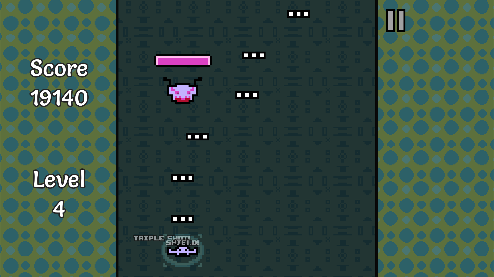
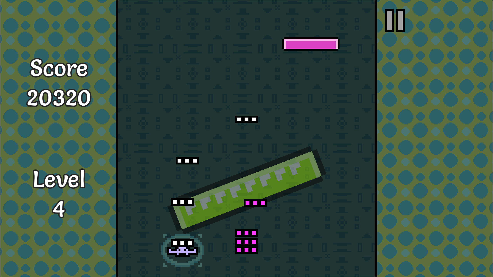

Pew Pew Baba is out on itch.io!

<iframe frameborder="0" src="https://itch.io/embed/2539667?linkback=true&amp;dark=true" width="552" height="167"><a href="https://lucypero.itch.io/pew-pew-baba">Pew Pew Baba by Lucy</a></iframe>

I decided to make a simple shoot-em-up in Godot as my first Godot project. It was mainly to get more familiar with Godot. But I had a lot of fun making it, and I think it turned out great! The game is very fun and addictive, at times. The game has 10 levels (the last one goes on forever), and it has various enemy types and powerups. Only two buttons are needed to play! A/D, or Left/Right key. Controllers are also supported.

I used [Aseprite](https://www.aseprite.org/) for the pixel art and [Bfxr](https://www.bfxr.net/) for the sound effects. My boyfriend made the awesome music track.

This project made me learn how to do basic things in Godot like custom shaders with properties that I can modify via code, tweening, instancing, UI, and more.

I wrote this project in GDScript. In Godot, you also have the choice of coding in C#. Since finishing this project, I took an interest in C#, and as of right now I am mainly using C# for my Godot projects. I like it because of all the correctness guarantees you get out of static typing. Also C# has more tools to make your code more robust. It has some disadvantages compared to GDScript though, of course.

## Technologies used

- [Godot](https://godotengine.org/) (GDScript scripting)
- [Aseprite](https://www.aseprite.org/) for art
- [Bfxr](https://www.bfxr.net/) for sound effects

## Screenshots

## Gameplay Video

<iframe width="560" height="315" src="https://www.youtube.com/embed/1ABjfJQ6L5w?si=dGTE0mlccb7zIfXD" title="YouTube video player" frameborder="0" allow="accelerometer; autoplay; clipboard-write; encrypted-media; gyroscope; picture-in-picture; web-share" allowfullscreen></iframe>