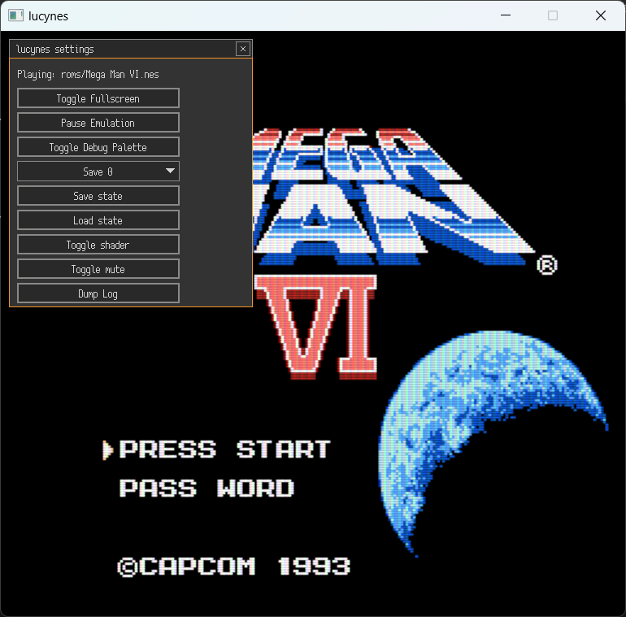
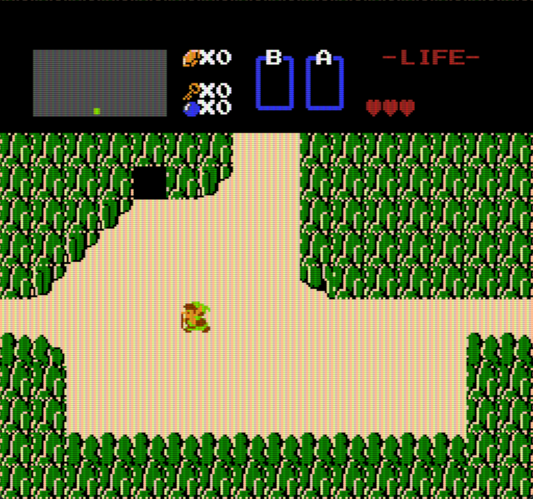
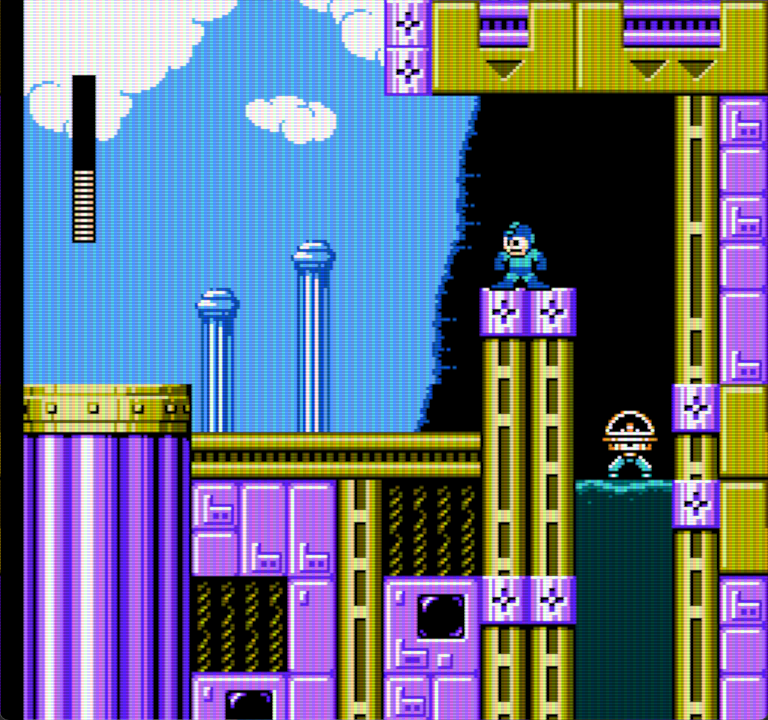
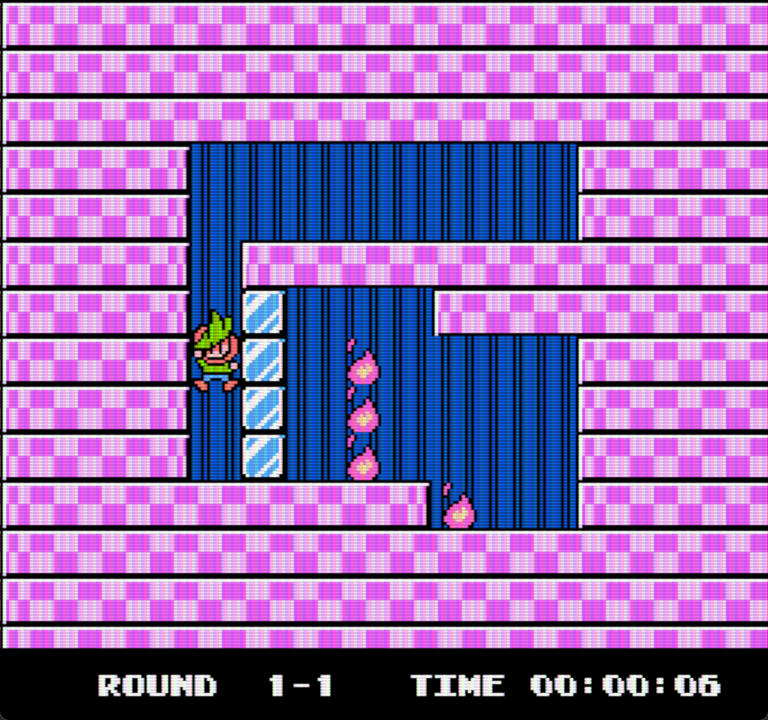
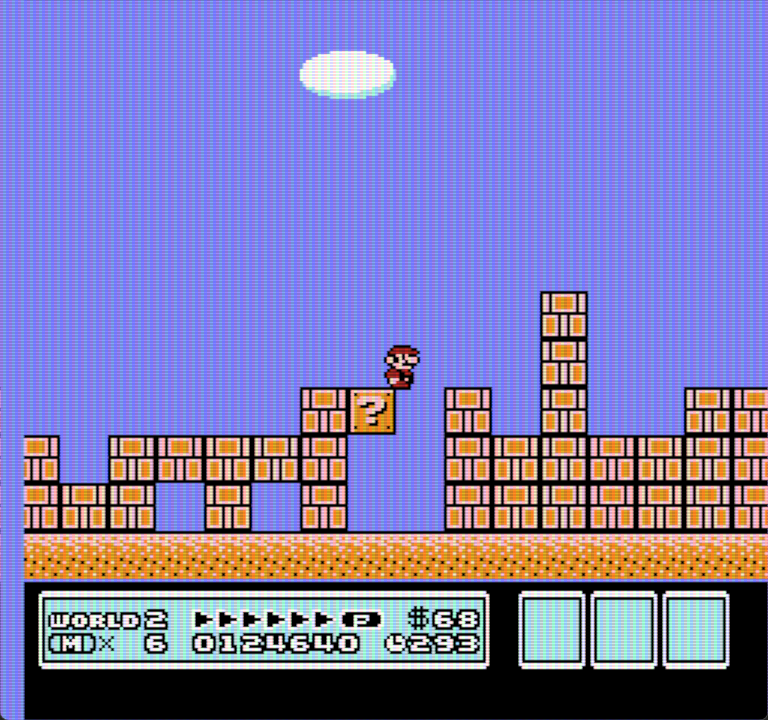
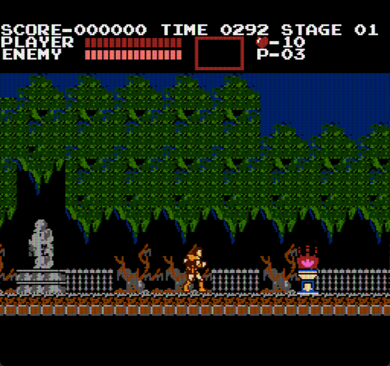
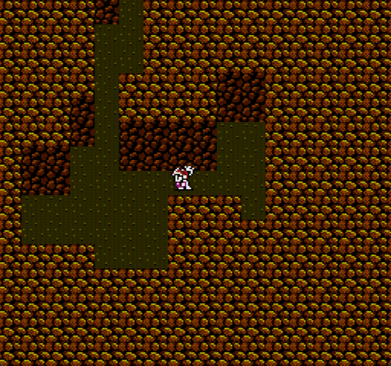

I made a NES emulator in [Odin](https://odin-lang.org/)!

[Github link](https://github.com/lucypero/lucynes)



## Intro

I've started this project in late June of 2024. I've worked on it in my spare time off and on. I decided to put a pause on this project in January 2025 to focus on other things.

I've learned so much about:

- The NES architecture, and possibly about game console architectures in general
- Bits and bytes, hex notation, and bitwise operations.
- The Odin programming language. I haven't used it on a serious project before.
- How computers work. CPU instructions, "cycles", etc
- Emulation. It's very hard. Respect to emulator developers!

It's been a wild ride. I've had a lot of fun, but I've also suffered more towards the end, when trying to make the emulator "fully" accurate.

You can read the [Github Readme](https://github.com/lucypero/lucynes) for a list of features, a roadmap, and some pictures and videos.

## Making an emulator

I've seen some people say that making a NES emulator is a simple weekend project, and I frankly found that baffling. Because *evidently*, it's not. It took me 7 months to get my emulator to how it is now.

I think what they actually mean is that getting a NES emulator "working" takes a short time. Like maybe getting Donkey Kong to run. And that's true. You can get to 80% or maybe 90% pretty fast. It's the last 10% that takes a long, long time.

The NES hardware has many idiosyncrasies that need to be emulated for certain games to run. Many games depend on very specific NES behavior. And if you don't implement it right, they won't run. A lot of the challenge is about timing. The CPU and the PPU (the chip that handles the graphics rendering in the NES) run in parallel and they communicate with each other. That timing needs to be very accurate, or many wrong things can happen. Most games will run fine with a less than accurate emulator, but a lot of them won't, and they will need you to consider things in more detail.

Another issue is *mappers*. Mappers are what we call an implementation of a type of cartridge. You see, NES games come in cartridges, and cartridges aren't just data. They are circuitry with their own behavior and extra resources like read-only memory, and writable memory. Some come with extra audio capabilities, but I haven't implemented that.

Anyway, you have to implement these mappers if you want a game that comes in that cartridge to run in your game. They complete the NES's circuitry. In a way, they are a part of the NES hardware. There are many mappers, but you can support a lot of games by just implementing a few. I've had trouble implementing some mappers, and some of them are still badly implemented, causing some games to not work. I found it hard to understand some of the mapper documentation.

The biggest challenge with making an emulator, I think, is to know what to implement. Information about the hardware, and what needs to be emulated about the hardware for games to work in your emulator. Thankfully, the NES is very well documented online. I've used many resources, like:

- [The Nesdev wiki](https://www.nesdev.org/wiki/Nesdev_Wiki)
- [The nesdev wiki discord](https://discord.com/invite/JSG4kuF8EK). People here have helped me with my issues a lot.
- [Javidx's NES series](https://www.youtube.com/watch?v=F8kx56OZQhg). The code has many mistakes but it's a good starting point.
- [This article about the NES's PPU](https://austinmorlan.com/posts/nes_rendering_overview/#pattern-table)
- [Test ROMS](https://github.com/christopherpow/nes-test-roms). These NES ROMS thoroughly test particular aspects of your emulator. This is an extraordinary tool to accelerate development of emulator accuracy.

I wouldn't have been able to do any of this without these resources and the help from people in the nesdev discord.

## Odin

I've learned a lot about Odin while making this project. I think it fit this project like a glove. Being a very simple, strongly typed C-like language that gives me all the freedom I want makes making an emulator much easier than using other languages, I feel.

One thing that threw me off was that Odin has no [automatic integer promotion](https://www.skillvertex.com/blog/integer-promotions-in-c/). When doing calculations on numbers, Odin will never promote types to a bigger one. That led to a few bugs. But I blame this all on me and me being used to C's integer promotion.

One fun thing that I've learned was doing a bit of memory allocation strategy. Odin has no automatic memory management, so you have to come up with smart ways to handle memory. I've had fun thinking about how I should handle memory best. I didn't need to do anything complicated. I mostly use one temporary allocator that clears every frame, a global heap allocator for things that need to live forever, and a NES Arena allocator for anything that needs to live along a NES session. I found memory allocation fun.

Another thing I had to learn is how to serialize Odin objects. I used the CBOR library, and I ran into a few issues. I thought my code was misbehaving due to a bug in the library, but that was [cleared up](https://github.com/odin-lang/Odin/issues/4661). It was only having trouble because I made a few odd types that it didn't know how to serialize. Once I learned how to properly write custom handling for types, everything worked perfectly. This was one of the tricky types that cbor didn't know how to serialize:

```c
PpuCtrl :: struct #raw_union {
	// VPHB SINN
	using flags: bit_field u8 {
		n: u8 | 2,
		i: u8 | 1,
		s: u8 | 1, // sprite pattern table address for 8x8 sprites (0: $0000, 1: $1000)
		b: u8 | 1, // bg pattern table address (0: $0000, 1: $1000)
		h: u8 | 1, // sprite size (0: 8x8, 1: 8x16)
		p: u8 | 1,
		v: u8 | 1, // vblank NMI enable
	},
	reg:         u8,
}
```

I love how Odin lets you define raw unions like this, and with bit fields. It fits emulator development very well.

## What's missing

I don't consider this project "finished". Of course, a project like this is never truly finished, but a lot of aspects of it need a lot of work, for sure:

- The sound. lucyNES doesn't sound very well still. Some games will sound fine but most won't. I have to improve the implementation, and implement the DMC channel which I haven't done.
- Some games that I've tested don't work due to a poor mapper implementation
- I could implement more mappers so more games are supported.

These are the main things that are lacking at this moment. Maybe at some point I will return and keep working on this so the project can feel "complete".

## Showcase

### Debugger showcase

<video controls>
  <source src="../assets/images/lucynes/407106285-240fbda8-4e75-4b93-b485-15ab7fd3c7bb.mp4" type="video/mp4">
</video>

### Menu showcase

<video controls>
  <source src="../assets/images/lucynes/407106126-a09d3cc3-a58b-44ea-8771-bcb8bb00a3d6.mp4" type="video/mp4">
</video>

### Game showcase













